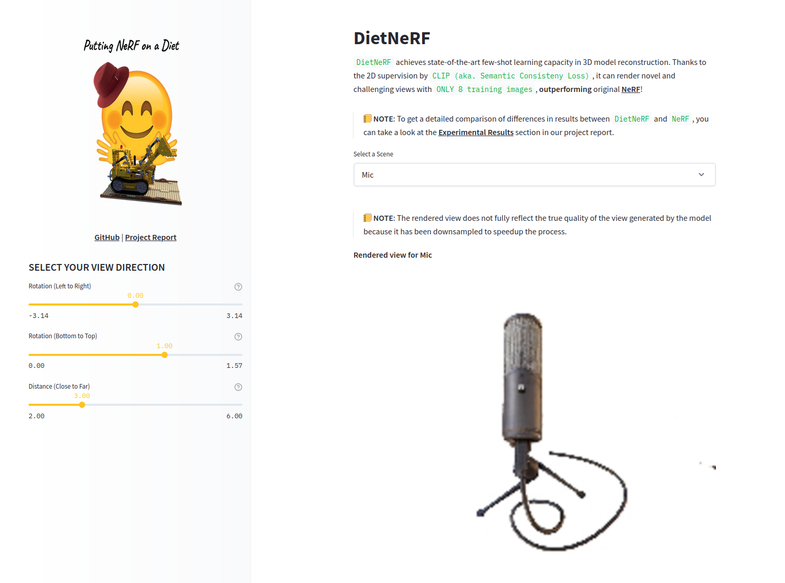
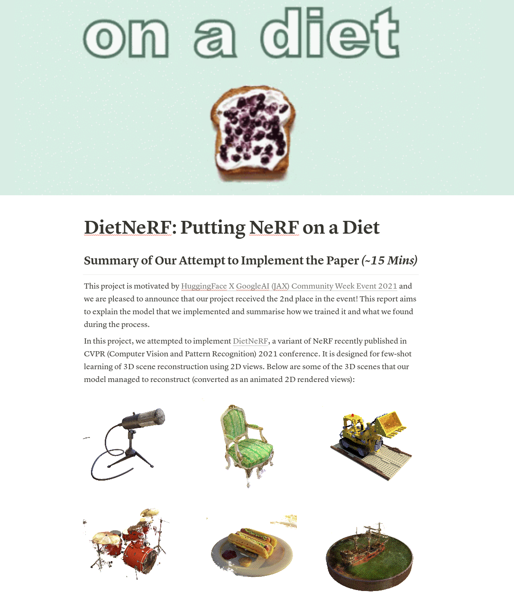
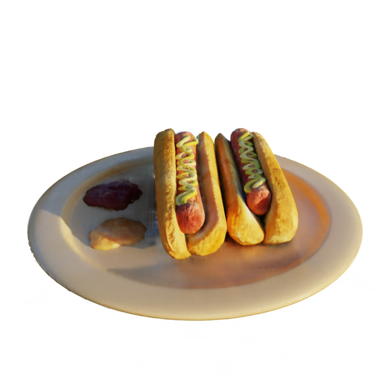
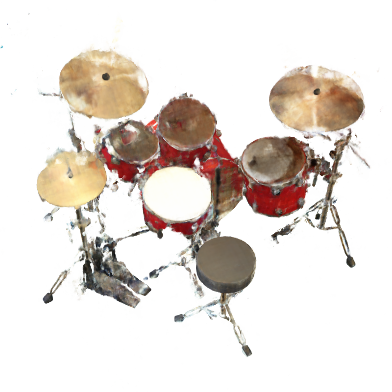
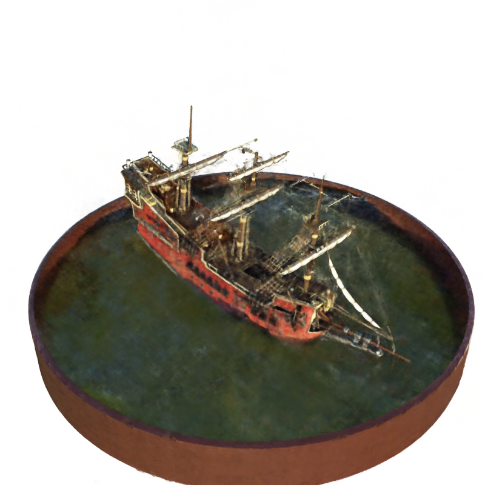
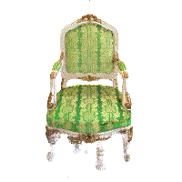
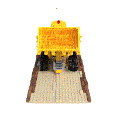
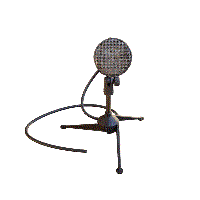
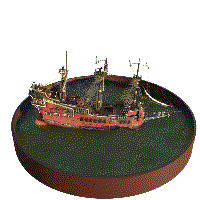

# Putting NeRF on a Diet: Semantically Consistent Few-Shot View Synthesis Implementation

[](https://huggingface.co/spaces/flax-community/DietNerf-Demo) [](https://colab.research.google.com/drive/1etYeMTntw5mh3FvJv4Ubb7XUoTtt5J9G?usp=sharing)

<p align="center"></p>

This project attempted to implement the paper **[Putting NeRF on a Diet](https://arxiv.org/abs/2104.00677)** (DietNeRF) in JAX/Flax.
DietNeRF is designed for rendering quality novel views in few-shot learning scheme, a task that vanilla NeRF (Neural Radiance Field) struggles.
To achieve this, the author coins **Semantic Consistency Loss** to supervise DietNeRF by prior knowledge from CLIP Vision Transformer. Such supervision enables DietNeRF to learn 3D scene reconstruction with CLIP's prior knowledge on 2D views.  

Besides this repo, you can check our write-up and demo here:
- ✍️ **[Write-up in Notion](https://steep-cycle-f6b.notion.site/DietNeRF-Putting-NeRF-on-a-Diet-4aeddae95d054f1d91686f02bdb74745)**: more details of DietNeRF and our experiments
- ✨ **[Demo in Hugging Face Space](https://huggingface.co/spaces/flax-community/DietNerf-Demo)**: showcase our trained DietNeRFs by Streamlit

## 🤩 Demo
1. You can check out [our demo in Hugging Face Space](https://huggingface.co/spaces/flax-community/DietNerf-Demo)
2. Or you can set up our Streamlit demo locally (model checkpoints will be fetched automatically upon startup)
```shell
pip install -r requirements_demo.txt
streamlit run app.py
```

<p align="center"></p>

## ✨ Implementation

Our code is written in JAX/ Flax and mainly based upon [jaxnerf](https://github.com/google-research/google-research/tree/master/jaxnerf) from Google Research. The base code is highly optimized in GPU & TPU. For semantic consistency loss, we utilize pretrained CLIP Vision Transformer from [transformers](https://github.com/huggingface/transformers) library.  

To learn more about DietNeRF, our experiments and implementation, you are highly recommended to check out our very detailed **[Notion write-up](https://www.notion.so/DietNeRF-Putting-NeRF-on-a-Diet-4aeddae95d054f1d91686f02bdb74745)**!

<p align="center"></p> 


 ##  🤗 Hugging Face Model Hub Repo
You can also find our project and our model checkpoints on our [Hugging Face Model Hub Repository](https://huggingface.co/flax-community/putting-nerf-on-a-diet/). The models checkpoints are located in `models` folder.

Our JAX/Flax implementation currently supports:

<table class="tg">
<thead>
  <tr>
    <th class="tg-0lax"><span style="font-weight:bold">Platform</span></th>
    <th class="tg-0lax" colspan="2"><span style="font-weight:bold">Single-Host GPU</span></th>
    <th class="tg-0lax" colspan="2"><span style="font-weight:bold">Multi-Device TPU</span></th>
  </tr>
</thead>
<tbody>
  <tr>
    <td class="tg-0lax"><span style="font-weight:bold">Type</span></td>
    <td class="tg-0lax">Single-Device</td>
    <td class="tg-0lax">Multi-Device</td>
    <td class="tg-0lax">Single-Host</td>
    <td class="tg-0lax">Multi-Host</td>
  </tr>
  <tr>
    <td class="tg-0lax"><span style="font-weight:bold">Training</span></td>
    <td class="tg-0lax"></td>
    <td class="tg-0lax"></td>
    <td class="tg-0lax"></td>
    <td class="tg-0lax"></td>
  </tr>
  <tr>
    <td class="tg-0lax"><span style="font-weight:bold">Evaluation</span></td>
    <td class="tg-0lax"></td>
    <td class="tg-0lax"></td>
    <td class="tg-0lax"></td>
    <td class="tg-0lax"></td>
  </tr>
</tbody>
</table>


## 💻 Installation

```bash
# Clone the repo
git clone https://github.com/codestella/putting-nerf-on-a-diet
# Create a conda environment, note you can use python 3.6-3.8 as
# one of the dependencies (TensorFlow) hasn't supported python 3.9 yet.
conda create --name jaxnerf python=3.6.12; conda activate jaxnerf
# Prepare pip
conda install pip; pip install --upgrade pip
# Install requirements
pip install -r requirements.txt
# [Optional] Install GPU and TPU support for Jax
# Remember to change cuda101 to your CUDA version, e.g. cuda110 for CUDA 11.0.
!pip install --upgrade jax "jax[cuda110]" -f https://storage.googleapis.com/jax-releases/jax_releases.html
# install flax and flax-transformer
pip install flax transformers[flax]
```

## ⚽ Dataset 
Download the datasets from the [NeRF official Google Drive](https://drive.google.com/drive/folders/128yBriW1IG_3NJ5Rp7APSTZsJqdJdfc1).
Please download the `nerf_synthetic.zip` and unzip them
in the place you like. Let's assume they are placed under `/tmp/jaxnerf/data/`.


## 🤟 How to Train
1. Train in our prepared [Colab notebook](https://colab.research.google.com/drive/1etYeMTntw5mh3FvJv4Ubb7XUoTtt5J9G?usp=sharing): Colab Pro is recommended, otherwise you may encounter out-of-memory
2. Train locally: set `use_semantic_loss=true` in your `yaml` configuration file to enable DietNeRF.
```
python -m train \
  --data_dir=/PATH/TO/YOUR/SCENE/DATA \ # (e.g. nerf_synthetic/lego)
  --train_dir=/PATH/TO/THE/PLACE/YOU/WANT/TO/SAVE/CHECKPOINTS \
  --config=configs/CONFIG_YOU_LIKE
```


## 💎 Experimental Results

### ❗ Rendered Rendering images by 8-shot learned DietNeRF

DietNeRF has a strong capacity to generalise on novel and challenging views with EXTREMELY SMALL TRAINING SAMPLES!

### HOTDOG / DRUM / SHIP / CHAIR / LEGO / MIC

<p align="center">
  <table>
    <tr>
      <td></td><td></td><td></td>
    <tr>
</table></p>
<p align="center">
  <table>
    <tr>
      <td></td><td></td><td></td>
    <tr>
</table></p>

### ❗ Rendered GIF by occluded 14-shot learned NeRF and Diet-NeRF

We made artificial occlusion on the right side of image (Only picked left side training poses).
The reconstruction quality can be compared with this experiment.
DietNeRF shows better quality than Original NeRF when It is occluded.

#### Training poses


#### LEGO
<p align="center">
  <table>
    <tr>
      <td>Diet NeRF</td><td>NeRF</td>
    <tr>
    <tr>
      <td></td><td></td>
    <tr>
  </table></p>

#### SHIP
<p align="center">
  <table>
    <tr>
      <td>Diet NeRF</td><td>NeRF</td>
    <tr>
    <tr>
      <td></td><td></td>
    <tr>
  </table></p>

## 👨‍👧‍👦 Our Teams


| Teams            | Members                                                                                                                                                        |
|------------------|----------------------------------------------------------------------------------------------------------------------------------------------------------------|
| Project Managing | [Stella Yang](https://github.com/codestella) To Watch Our Project Progress, Please Check [Our Project Notion](https://www.notion.so/Putting-NeRF-on-a-Diet-e0caecea0c2b40c3996c83205baf870d) |
| NeRF Team        | [Stella Yang](https://github.com/codestella), [Alex Lau](https://github.com/riven314), [Seunghyun Lee](https://github.com/sseung0703), [Hyunkyu Kim](https://github.com/minus31),  [Haswanth Aekula](https://github.com/hassiahk), [JaeYoung Chung](https://github.com/robot0321)          |
| CLIP Team        | [Seunghyun Lee](https://github.com/sseung0703), [Sasikanth Kotti](https://github.com/ksasi), [Khalid Sifullah](https://github.com/khalidsaifullaah) , [Sunghyun Kim](https://github.com/MrBananaHuman)                                |
| Cloud TPU Team   | [Alex Lau](https://github.com/riven314), [Aswin Pyakurel](https://github.com/masapasa), [JaeYoung Chung](https://github.com/robot0321),  [Sunghyun Kim](https://github.com/MrBananaHuman)                                                    |

*_Special mention to our "night owl" contributors 🦉:  [Seunghyun Lee](https://github.com/sseung0703), [Alex Lau](https://github.com/riven314), [Stella Yang](https://github.com/codestella), [Haswanth Aekula](https://github.com/hassiahk)_

## 💞 Social Impact

 - Game Industry
 - Augmented Reality Industry
 - Virtual Reality Industry
 - Graphics Industry
 - Online shopping
 - Metaverse
 - Digital Twin
 - Mapping / SLAM

## 🌱 References
This project is based on “JAX-NeRF”.
```
@software{jaxnerf2020github,
  author = {Boyang Deng and Jonathan T. Barron and Pratul P. Srinivasan},
  title = {{JaxNeRF}: an efficient {JAX} implementation of {NeRF}},
  url = {https://github.com/google-research/google-research/tree/master/jaxnerf},
  version = {0.0},
  year = {2020},
}
```

This project is based on “Putting NeRF on a Diet”.
```
@misc{jain2021putting,
      title={Putting NeRF on a Diet: Semantically Consistent Few-Shot View Synthesis}, 
      author={Ajay Jain and Matthew Tancik and Pieter Abbeel},
      year={2021},
      eprint={2104.00677},
      archivePrefix={arXiv},
      primaryClass={cs.CV}
}
```

## 🔑 License
[Apache License 2.0](https://github.com/codestella/putting-nerf-on-a-diet/blob/main/LICENSE)

## ❤️ Special Thanks 

Our Project is motivated by [HuggingFace X GoogleAI (JAX) Community Week Event 2021](https://discuss.huggingface.co/t/open-to-the-community-community-week-using-jax-flax-for-nlp-cv/7104).

We would like to take this chance to thank Hugging Face for organizing such an amazing open-source initiative, Suraj and Patrick for all the technical help. 
We learn a lot throughout this wonderful experience!

<p align="center"></p>

Finally, we would like to thank [Common Computer AI](https://comcom.ai/en/) for sponsoring our team access to V100 multi-GPUs server.
Thank you so much for your support!
<p align="center"></p>


