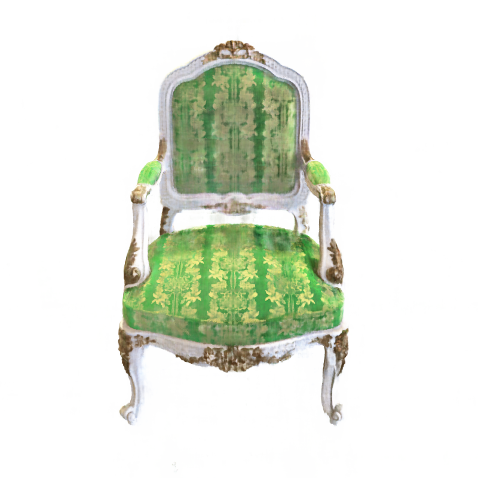
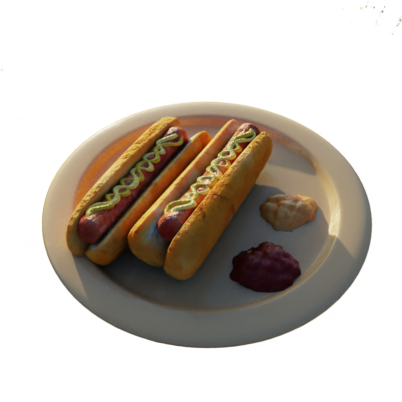
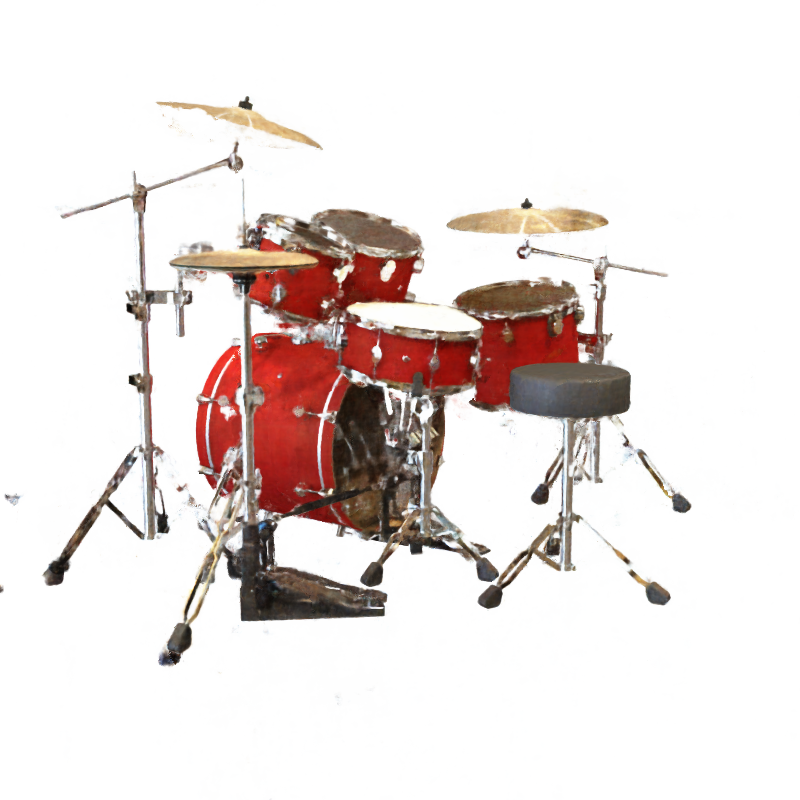
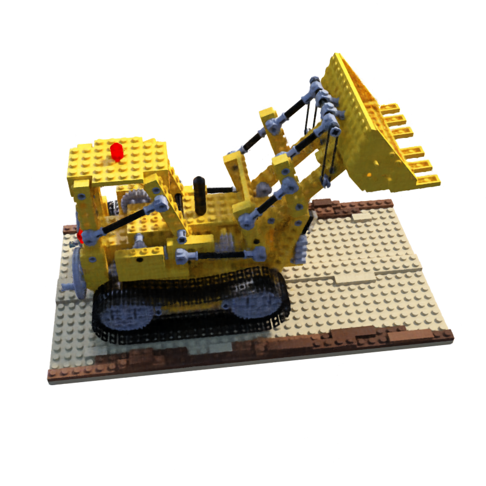
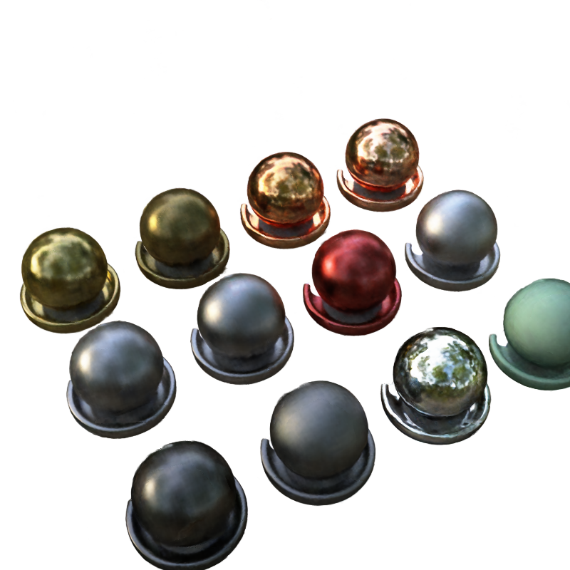
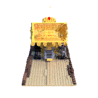
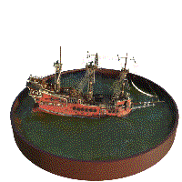
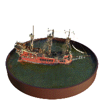

# Putting NeRF on a Diet: Semantically Consistent Few-Shot View Synthesis Implementation

<p align="center"></p>

Welcome to Putting NeRF on a Diet Project! 
This project is the Pytorch, JAX/Flax based code implementation of this paper [Putting NeRF on a Diet : Ajay Jain, Matthew Tancik, Pieter Abbeel, Arxiv : https://arxiv.org/abs/2104.00677] 
The model generates the novel view synthesis redering (NeRF: Neural Radiances Field) with Fewshot learning scheme.
The semantic loss use the pre-trained CLIP Vision Transformer embedding. This information can give a 2D supervision for 3D.
The Diet NeRF result outperforms the original NeRF in 3D reconstruction and neural rendering with only few images. 


##  🤗 Hugging Face Hub Repo URL:
We will also upload our project on the Hugging Face Hub Repository Also. 
[https://huggingface.co/flax-community/putting-nerf-on-a-diet/](https://huggingface.co/flax-community/putting-nerf-on-a-diet/)

Our JAX/Flax implementation currently supports:

<table class="tg">
<thead>
  <tr>
    <th class="tg-0lax"><span style="font-weight:bold">Platform</span></th>
    <th class="tg-0lax" colspan="2"><span style="font-weight:bold">Single-Host GPU</span></th>
    <th class="tg-0lax" colspan="2"><span style="font-weight:bold">Multi-Device TPU</span></th>
  </tr>
</thead>
<tbody>
  <tr>
    <td class="tg-0lax"><span style="font-weight:bold">Type</span></td>
    <td class="tg-0lax">Single-Device</td>
    <td class="tg-0lax">Multi-Device</td>
    <td class="tg-0lax">Single-Host</td>
    <td class="tg-0lax">Multi-Host</td>
  </tr>
  <tr>
    <td class="tg-0lax"><span style="font-weight:bold">Training</span></td>
    <td class="tg-0lax"></td>
    <td class="tg-0lax"></td>
    <td class="tg-0lax"></td>
    <td class="tg-0lax"></td>
  </tr>
  <tr>
    <td class="tg-0lax"><span style="font-weight:bold">Evaluation</span></td>
    <td class="tg-0lax"></td>
    <td class="tg-0lax"></td>
    <td class="tg-0lax"></td>
    <td class="tg-0lax"></td>
  </tr>
</tbody>
</table>

## 🤩 Demo

You can check our Streamlit Space demo on following site !
[https://huggingface.co/spaces/flax-community/DietNerf-Demo](https://huggingface.co/spaces/flax-community/DietNerf-Demo)


## 💻 Installation

```bash
# Clone the repo
svn export https://github.com/google-research/google-research/trunk/jaxnerf
# Create a conda environment, note you can use python 3.6-3.8 as
# one of the dependencies (TensorFlow) hasn't supported python 3.9 yet.
conda create --name jaxnerf python=3.6.12; conda activate jaxnerf
# Prepare pip
conda install pip; pip install --upgrade pip
# Install requirements
pip install -r jaxnerf/requirements.txt
# [Optional] Install GPU and TPU support for Jax
# Remember to change cuda101 to your CUDA version, e.g. cuda110 for CUDA 11.0.
pip install --upgrade jax jaxlib==0.1.57+cuda101 -f https://storage.googleapis.com/jax-releases/jax_releases.html
# install flax and flax-transformer
pip install flax transformer[flax]
```

## ⚽ Dataset 
Download the datasets from the [NeRF official Google Drive](https://drive.google.com/drive/folders/128yBriW1IG_3NJ5Rp7APSTZsJqdJdfc1).
Please download the `nerf_synthetic.zip` and unzip them
in the place you like. Let's assume they are placed under `/tmp/jaxnerf/data/`.


## 💖 Methods

You can check more detail explaination about DietNeRF on following **Notion Report**
* 👉👉 VEEEERY Detail DietNeRF Explaination Docs : (https://bit.ly/3x4FwcT)👈👈

<p align="center"></p> 

Based on the principle
that “a bulldozer is a bulldozer from any perspective”, Our proposed DietNeRF supervises the radiance field from arbitrary poses
(DietNeRF cameras). This is possible because we compute a semantic consistency loss in a feature space capturing high-level
scene attributes, not in pixel space. We extract semantic representations of renderings using the CLIP Vision Transformer, then
maximize similarity with representations of ground-truth views. In
effect, we use prior knowledge about scene semantics learned by
single-view 2D image encoders to constrain a 3D representation.

You can check detail information on the author's paper. Also, you can check the CLIP based semantic loss structure on the following image.
<p align="center"></p>

Our code used JAX/FLAX framework for implementation. So that it can achieve much speed up than other NeRF code. Moreover, we implemented multiple GPU distribution ray code. it helps much smaller training time. At last, our code used hugging face, transformer,  CLIP model library. 

## 🤟 How to use
```
python -m train \
  --data_dir=/PATH/TO/YOUR/SCENE/DATA \ % e.g., nerf_synthetic/lego
  --train_dir=/PATH/TO/THE/PLACE/YOU/WANT/TO/SAVE/CHECKPOINTS \
  --config=configs/CONFIG_YOU_LIKE
```
You can toggle the semantic loss by “use_semantic_loss” in configuration files.

## 💎 Expriment Result

### ❗ Rendered Rendering images by 8-shot learned Diet-NeRF

DietNeRF has a strong capacity to generalise on novel and challenging views with EXTREMELY SMALL TRAINING SAMPLES!

### CHAIR / HOTDOG / DRUM / LEGO / MATERIALS

<p align="center">
  <table>
    <tr>
      <td></td><td></td><td></td>
    <tr>
</table></p>
<p align="center">
  <table>
    <tr>
      <td></td><td></td>
    <tr>
</table></p>

### ❗ Rendered GIF by occluded 14-shot learned NeRF and Diet-NeRF

We made aritificial occulusion on the right side of image (Only picked left side training poses).
The reconstruction quality can be compared with this experiment.
Diet NeRF shows better quailty than Original NeRF when It is occulused.

#### Training poses


#### LEGO
<p align="center">
  <table>
    <tr>
      <td></td><td></td>
    <tr>
  </table></p>

#### SHIP
<p align="center">
  <table>
    <tr>
      <td></td><td></td>
    <tr>
  </table></p>

## 👨‍👧‍👦 Our Teams


| Teams            | Members                                                                                                                                                        |
|------------------|----------------------------------------------------------------------------------------------------------------------------------------------------------------|
| Project Managing | [Stella Yang](https://github.com/codestella) To Watch Our Project Progress, Please Check [Our Project Notion](https://www.notion.so/Putting-NeRF-on-a-Diet-e0caecea0c2b40c3996c83205baf870d) |
| NeRF Team        | [Stella Yang](https://github.com/codestella), [Alex Lau](https://github.com/riven314), [Seunghyun Lee](https://github.com/sseung0703), [Hyunkyu Kim](https://github.com/minus31),  [Haswanth Aekula](https://github.com/hassiahk), [JaeYoung Chung](https://github.com/robot0321)          |
| CLIP Team        | [Seunghyun Lee](https://github.com/sseung0703), [Sasikanth Kotti](https://github.com/ksasi), [Khali Sifullah](https://github.com/khalidsaifullaah) , [Sunghyun Kim](https://github.com/MrBananaHuman)                                |
| Cloud TPU Team   | [Alex Lau](https://github.com/riven314), [Aswin Pyakurel](https://github.com/masapasa) , [JaeYoung Chung](https://github.com/robot0321),  [Sunghyun Kim](https://github.com/MrBananaHuman)                                                    |

* Extremely Don't Sleep Contributors 🤣 :  [Seunghyun Lee](https://github.com/sseung0703), [Alex Lau](https://github.com/riven314), [Stella Yang](https://github.com/codestella)


## 🌱 References
This project is based on “JAX-NeRF”.
```
@software{jaxnerf2020github,
  author = {Boyang Deng and Jonathan T. Barron and Pratul P. Srinivasan},
  title = {{JaxNeRF}: an efficient {JAX} implementation of {NeRF}},
  url = {https://github.com/google-research/google-research/tree/master/jaxnerf},
  version = {0.0},
  year = {2020},
}
```

This project is based on “JAX-NeRF”.
```
@misc{jain2021putting,
      title={Putting NeRF on a Diet: Semantically Consistent Few-Shot View Synthesis}, 
      author={Ajay Jain and Matthew Tancik and Pieter Abbeel},
      year={2021},
      eprint={2104.00677},
      archivePrefix={arXiv},
      primaryClass={cs.CV}
}
```

## 🔑 License
[Apache License 2.0](https://github.com/codestella/putting-nerf-on-a-diet/blob/main/LICENSE)

## ❤️ Special Thanks 


Our Project is started in the HuggingFace X GoogleAI (JAX) Community Week Event.
https://discuss.huggingface.co/t/open-to-the-community-community-week-using-jax-flax-for-nlp-cv/7104

Thank you for our mentor Suraj and organizers in JAX/Flax Community Week! 
Our team grows up with this community learning experience. It was wonderful time!

<p align="center"></p>

Common Computer AI(https://comcom.ai/ko/) sponsored the multiple V100 GPUs for our project!
Thank you so much for your support!
<p align="center"></p>


